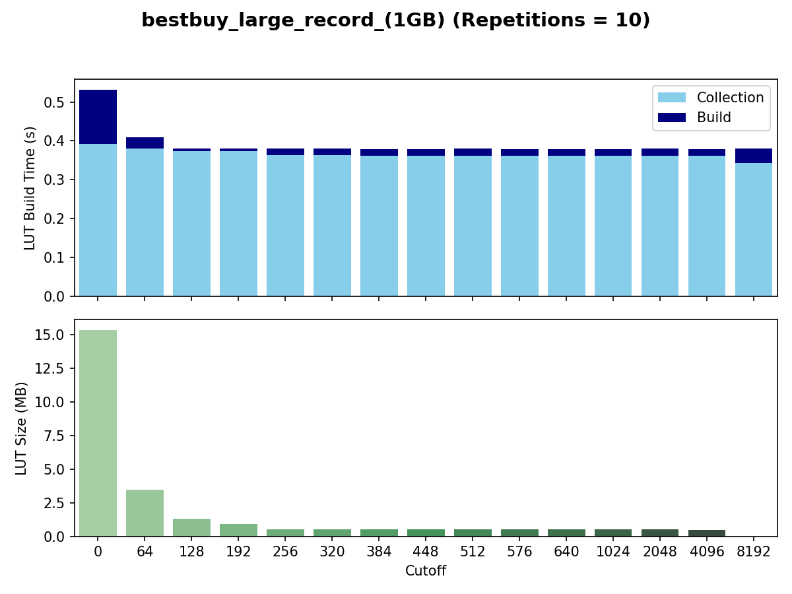

# rsonpath-plotting

A Python project for generating plots to analyze and visualize results from **[rsonpath-lut](https://github.com/KraftRicardo/rsonpath/tree/main)** experiments
and its lookup-table (LUT) modification.

---

## ✨ Features

This repository includes multiple plotting scripts, each producing specialized figures for different aspects of `rsonpath-lut` performance.  
All figures below are automatically generated using the data generated from there.

---

Bracket Distribution
How many curly and how many squary brackets each json has in relation per json.

### 🔎 Query Skip Percentage
**`plot_query_skip_percentage`**  
Visualizes the percentage of skipped bytes for different queries on a JSON file.

---

### 📏 Distance Distributions (per JSON)

**`plot_distance_distribution_per_json`**  
Plots the distance distribution of a JSON. Three variants:

- Default: x-axis doubles each step  
  

- Omit labels and titles (compact mode)  
  

- Fixed-step (64) x-axis growth  
  

---

### 📏 Distance Distributions (per Query)

**`plot_distance_distribution_per_query`**  
Plots the distance distribution of all jumps taken during a query on a given JSON.

- Default: x-axis doubles each step  
  

- Fixed-step (64) x-axis growth  
  

- With execution time spent in each bucket (relative to total skip time)  
  

---

### ⚡ Serde Size and Build Time
**`plot_serde_size_and_build_time`**  
Plots Serde’s build time and heap ratio compared to the input JSON.

---

[//]: # (### 🔧 Distance Cutoff Experiments)

[//]: # ()
[//]: # (**`plot_distance_cutoff`**  )

[//]: # (Compares query speed for the LUT implementation at different cutoffs. Also shows LUT size and build time.)

[//]: # ()
[//]: # (![plot_distance_cutoff]&#40;res/readme_figures/plot_distance_cutoff.png&#41;)

[//]: # ()
[//]: # (---)

[//]: # ()
[//]: # (**`plot_distance_cutoff_sizes`**  )

[//]: # (Visualizes LUT sizes and build times per cutoff and JSON:)

[//]: # ()
[//]: # (- LUT sizes &#40;MB&#41;  )

[//]: # (  ![plot_distance_cutoff_sizes_size]&#40;res/readme_figures/plot_distance_cutoff_sizes_size.png&#41;)

[//]: # ()
[//]: # (- LUT build times &#40;s&#41;  )

[//]: # (  ![plot_distance_cutoff_sizes_build_time]&#40;res/readme_figures/plot_distance_cutoff_sizes_build_time.png&#41;)

[//]: # ()
[//]: # (- Relative to cutoff = 0 &#40;percent scale&#41;  )

[//]: # (  ![plot_distance_cutoff_sizes_combined]&#40;res/readme_figures/plot_distance_cutoff_sizes_combined.png&#41;)

[//]: # ()
[//]: # (---)

### 🪶 Empty List Optimization
**`plot_empty_list_opt`**  
Compares `rq_legacy` vs. `rq_legacy_empty_list_opt` to evaluate the effect of the `empty_list_opt` feature.

---
### 🪶 RQ-LUT-NO-LUT
**`plot_empty_list_opt`**  
Compares `rq_legacy` vs. `rq_lut_no_lut` to evaluate the effect of the base code changes on the speed.

---

### 🧱 LUT Construction
**`plot_lut_construction`**  
Compares different LUT implementations in build-time, query-time, and heap size.

After deciding for a LUT implementation one can now plot the LUT build speed and size for different cutoffs, while
also tracking how long the collection step of the brackets takes.

---

### 🏁 Final Comparison
**`plot_final`**  
Compares, for each query, how fast `rq`, `rq-lut`, and `serde` are.  
Includes build times for LUTs and the Serde DOM.  
(`rq` build time = 0, as it is a streaming approach.)

- With labels  
  

- Without labels  
  

---

### 🥇 Optimal vs. Implementations
**`plot_optimal`**  
Compares query speed of `rq-legacy` vs. the theoretical optimal vs. `rq-lut` with varying cutoffs for the COUNT queries.

A table to find the best cutoff based on that data.

Like plot optimal but this time we queried for the complete results (NODE and not COUNT) which means we can also compare
it with serde.

---

