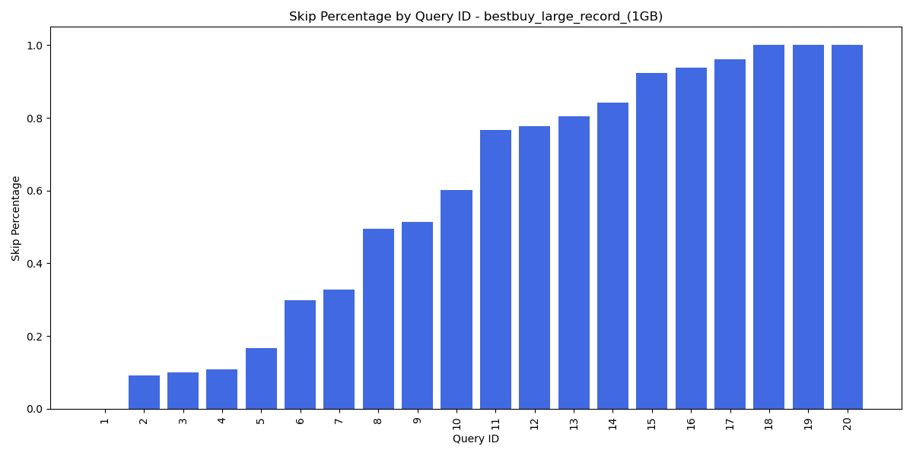
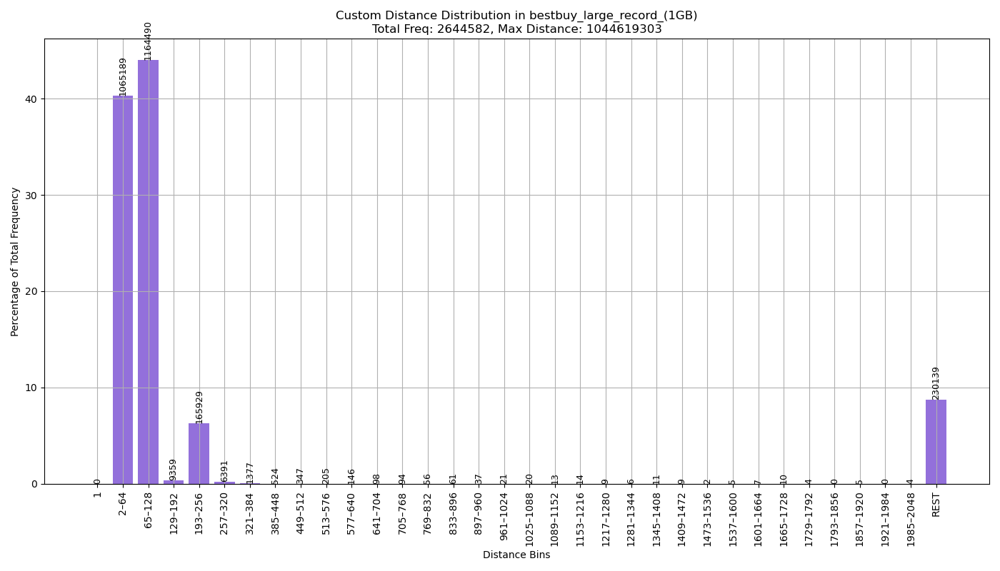
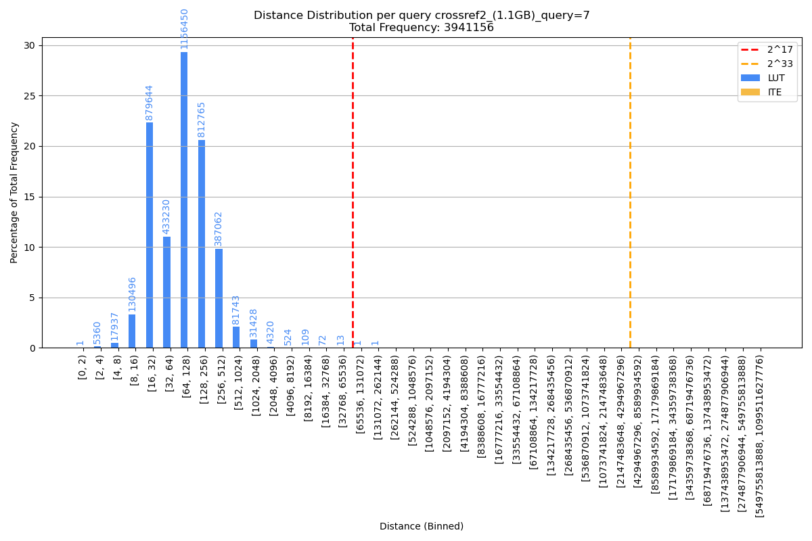
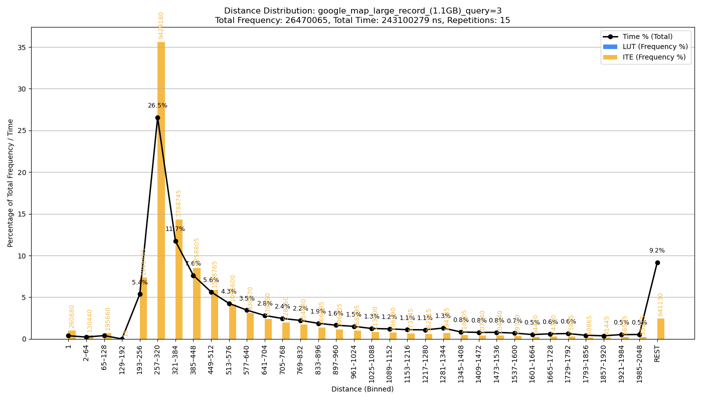
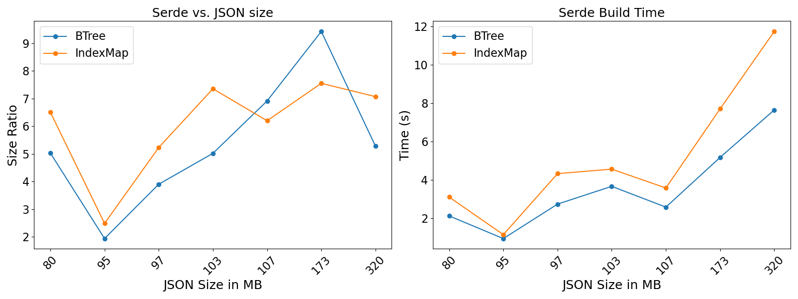
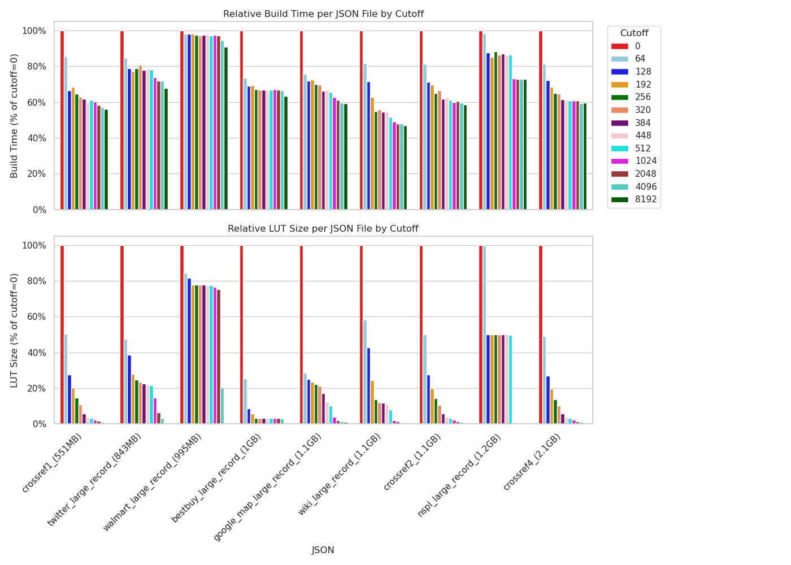
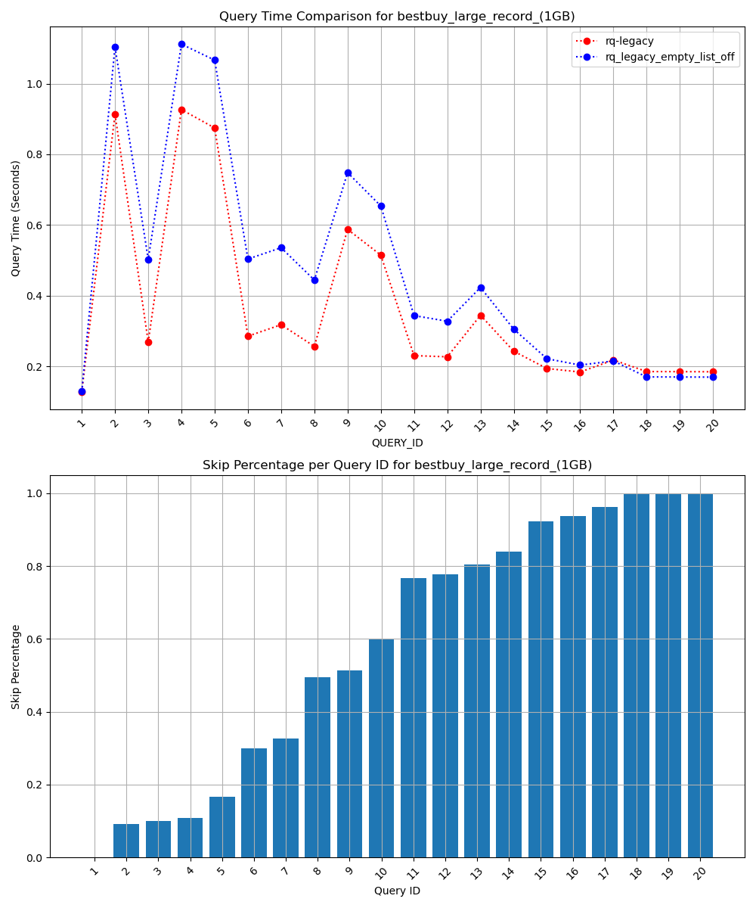
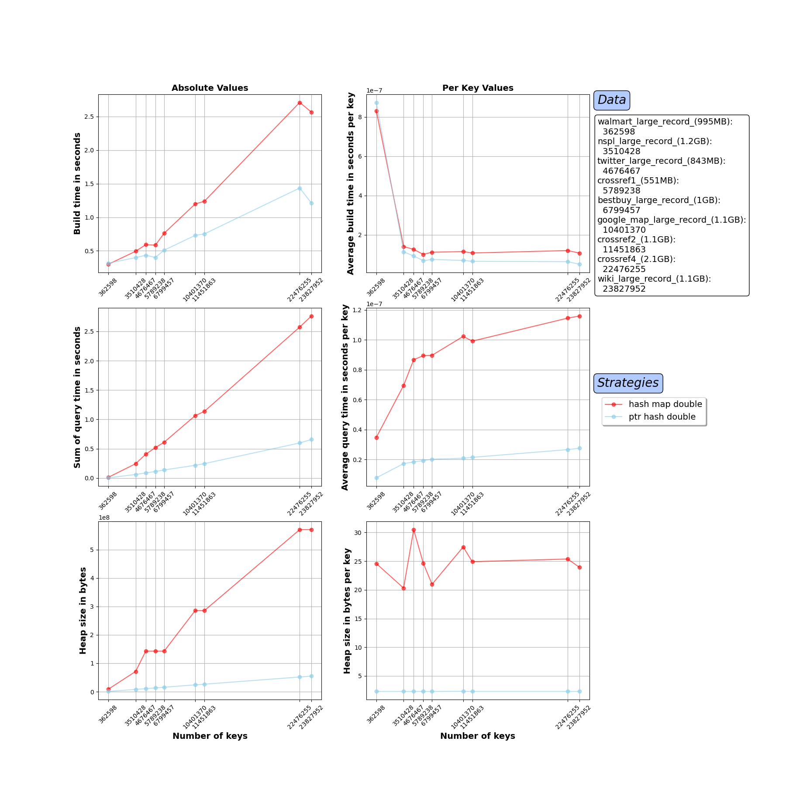
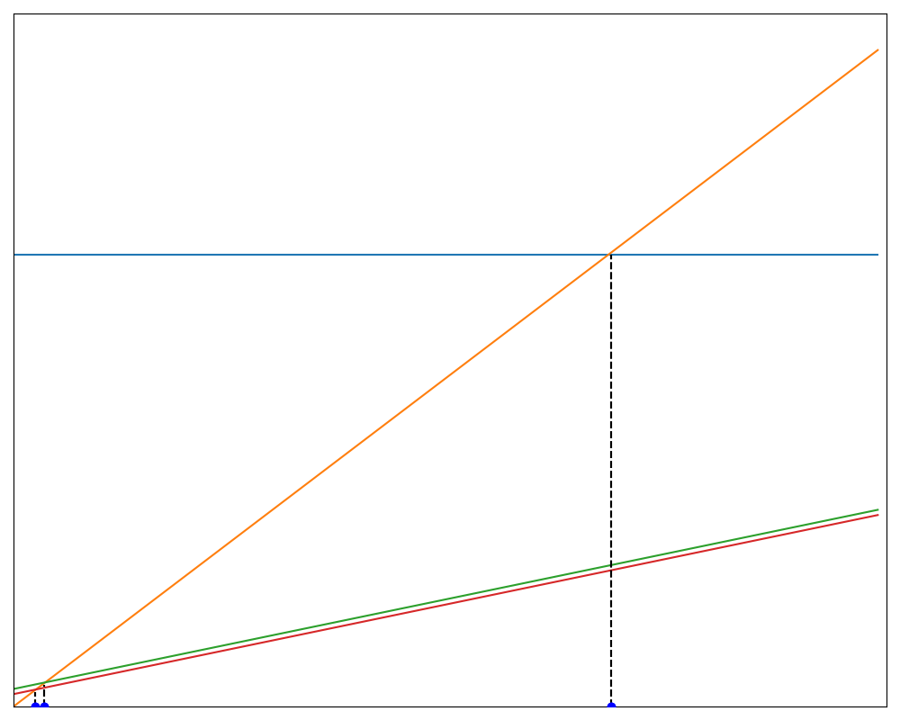
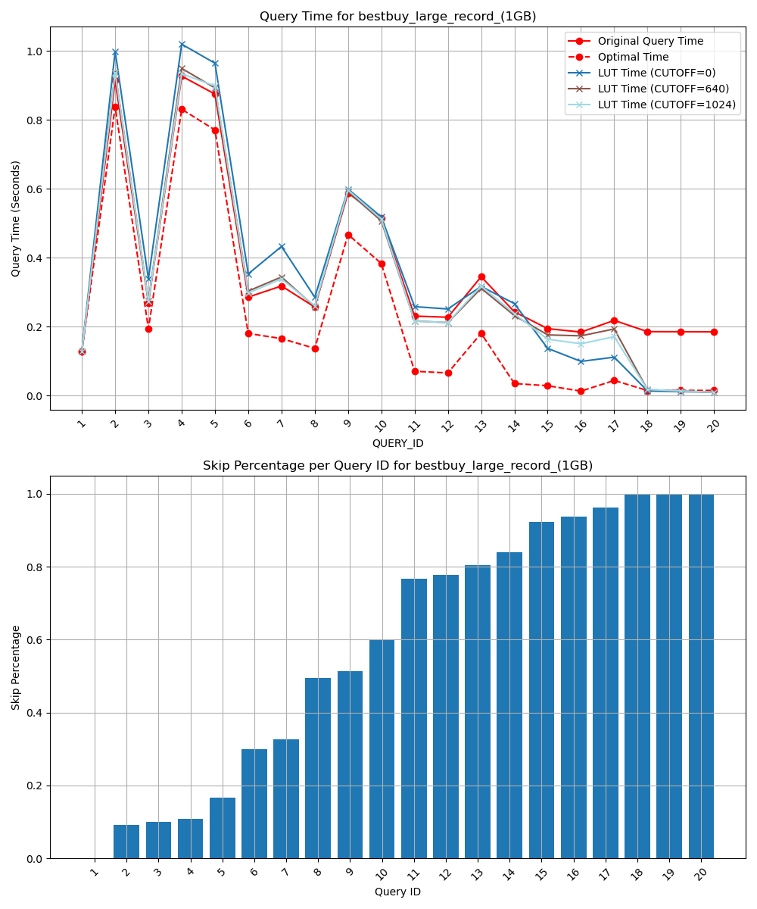

# rsonpath-plotting

A small Python project for generating plots to analyze and visualize results from **rsonpath** experiments.  
It provides convenient plotting functions to turn raw experiment outputs into informative figures.

---

## Features

The following plots can be generated (work in progress):

- **`plot_query_skip_percentage`**  
  Visualizes the total percentage of skipped bytes for different queries on a JSON.  
  

- **`plot_distance_distribution_per_json`**  
  Plot the distance distribution of a json. Has three options:
  - Default plot with x-axis doubling each step
  
  - When you want to omit labels and titles
  
  - When you want the x-axis to grow by 64 each step
  

- **`plot_distance_distribution_per_query`**  
  Plot the distance distribution of all the jumps taken during a query on a given json. Has 2 options:
  - Default plot with x-axis doubling each step
  
  - When you want the x-axis to grow by 64 each step
  

- **`plot_distance_distribution_per_query`**
  When you additionally want to know how much time is spent in each bucket in relation to the total skip time.
  

- **`plot_serde_size_and_build_time`**
  When you want to plot serde's build time and heap ratio compared to the input json.
  

- **`plot_distance_cutoff`**
  Plot the performance of the query speed of the LUT implementation for different cutoffs. Also shows the size and build time for each LUT.
  

- **`plot_distance_cutoff_sizes`**
  - Plot the LUT sizes for different cutoffs and different json.
  
  - Plot the LUT build times for different cutoffs and different json.
  
  - Plot the LUT build times and sizes for different cutoffs and different json in relation to cutoff=0.
  

- **`plot_empty_list_opt`**
Compare rq_legacy vs. rq_legacy_empty_list_opt to see what the effects of the empty_list_opt feature are.

- **`plot_lut_construction`**
  Compare different LUT implementations in build-time, query-time and heap size.
  

- **`plot_final`**
Final plot where we compare for each query how fast rq, rq-lut and serde are. This plot also considers the build time
for the LUTs and or the serde DOM. rq has a build time = 0 due to being a full streaming approach.
  - Labeled
    
  - Unlabeled
    

- **`plot_optimal`**
  Compare the query speed of rq-legacy vs. the theoretical optimal time vs. the rq-lut with different cutoffs.
  
---